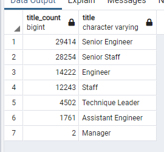

# Pewlett-Hackard-Analysis

### Module 7 Employee_Database_Challenge 
**File:** [Employee_Database_Challenge ](Queries/Employee_Database_challenge.sql)

## Overview of Pewlett-Hackard-Analysis:
The purpose of this analysis is to ensure that there are enough people to replace the number of people who are retiring and to also ensure to have enough eligible people avaiable to mentor the remaining employees.

## Results:
- Counting the number of employees who are retiring by title
- Obtain list of employees eligible for the mentorship eligibility

## Summary:
- The number of retiring employees comes to a total of  90,398 Employees thus that is the number of roles required to be filled for the silver tsunami  

- For the retirement-ready employees using 1955 as the basis of retiring employees, then all employees born between 1956-1965 would able to mentor the next generation. For the employees in 1965 it would come to a total of 1549 people. If we include the people between 1956-1964 then there would be an additional 166117 more employees.

 
